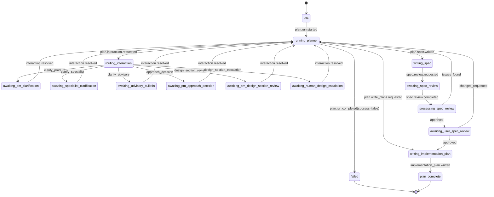

# Plan Feedback State Machine

**Goal:** Define the orchestrator-owned state machine for the plan phase so `openagent` planning can execute the `superpowers:brainstorming` and `superpowers:writing-plans` flow with explicit gates, deterministic routing, and restart-safe recovery.

**Architecture:** The planner emits structured interaction requests. The orchestrator owns workflow state, transport selection, persistence, escalation, and resume. State lives in `plan-state.json`; append-only `events/` are the audit trail; `interactions/`, `sessions.json`, and `spec-review/` are materialized sub-state.

## Scope

This state machine covers:

- brainstorming clarifications
- PM approach approval
- PM design-section approval
- PM-to-human escalation
- spec writing
- reviewer subagent loop
- human spec review
- transition to `writing-plans`

It does not cover:

- execute/check/act PDCA phases
- bulletin internals
- Anthropic SDK message streaming internals

## Design Principles

1. The orchestrator owns workflow state.
2. The planner owns artifact generation and structured interaction requests.
3. Every waiting state must have a durable external handle.
4. Every async waiting state must be restart-safe.
5. Human gates use the Discord PDCA thread.
6. PM is the primary design approver.
7. Bulletin is advisory-only.

## State Model

`plan-state.json.status` is the canonical machine state.

Valid states:

- `idle`
- `running_planner`
- `routing_interaction`
- `awaiting_pm_clarification`
- `awaiting_specialist_clarification`
- `awaiting_advisory_bulletin`
- `awaiting_pm_approach_decision`
- `awaiting_pm_design_section_review`
- `awaiting_human_design_escalation`
- `writing_spec`
- `awaiting_spec_review`
- `processing_spec_review`
- `awaiting_user_spec_review`
- `writing_implementation_plan`
- `plan_complete`
- `failed`

## State Categories

### Active compute states

These states are owned by the orchestrator/planner runtime and should not persist for long without producing another event:

- `running_planner`
- `routing_interaction`
- `writing_spec`
- `processing_spec_review`
- `writing_implementation_plan`

### Waiting states

These states wait on an external actor or transport:

- `awaiting_pm_clarification`
- `awaiting_specialist_clarification`
- `awaiting_advisory_bulletin`
- `awaiting_pm_approach_decision`
- `awaiting_pm_design_section_review`
- `awaiting_human_design_escalation`
- `awaiting_spec_review`
- `awaiting_user_spec_review`

### Terminal states

- `plan_complete`
- `failed`

## Top-Level Flow

## State Definitions

### `idle`

Meaning:
- No active planning workflow for the job.

Entry actions:
- Initialize `plan-state.json`
- Initialize `events/`

Exit condition:
- `plan.run.started`

### `running_planner`

Meaning:
- The planner session is actively executing in brainstorming or writing-plans mode.

Entry actions:
- start planner session if none exists
- resume planner SDK session if `resumeStrategy === "sdk_resume"`
- record `plan.run.started` or `plan.session.resumed`

Allowed incoming events:
- `plan.run.started`
- `plan.session.resumed`
- `plan.interaction.resolved`
- `plan.spec.review.completed` with issues
- `plan.spec.user_review.completed` with changes requested

Allowed outgoing events:
- `plan.interaction.requested`
- `plan.spec.written`
- `plan.write_plans.requested`
- `plan.run.completed`
- `plan.session.parked`

Transitions:
- to `routing_interaction` on `plan.interaction.requested`
- to `writing_spec` on `plan.spec.written`
- to `writing_implementation_plan` on `plan.write_plans.requested`
- to `failed` on unsuccessful completion

### `routing_interaction`

Meaning:
- The planner requested an interaction, and the orchestrator is choosing the owner + transport.

Entry actions:
- create `interactions/<id>.json`
- classify interaction kind
- resolve routing policy
- ensure required session binding exists
- emit `plan.interaction.routed`

Guards:
- exactly one active interaction may exist at a time
- interaction kind must map to a valid route

Transitions:
- to `awaiting_pm_clarification` for `clarify_product`
- to `awaiting_specialist_clarification` for `clarify_specialist`
- to `awaiting_advisory_bulletin` for `clarify_advisory`
- to `awaiting_pm_approach_decision` for `approach_decision`
- to `awaiting_pm_design_section_review` for `design_section_review`
- to `awaiting_human_design_escalation` for `design_section_escalation`
- to `failed` if no valid route exists

### `awaiting_pm_clarification`

Meaning:
- Waiting for PM to answer a single clarifying question.

Entry actions:
- establish PM session binding if absent:
  - `sessions_spawn(thread=true, mode="session")`
- otherwise use `sessions_send`
- record `plan.session.bound` or `plan.session.rebound`
- record `plan.session.parked`

Timeouts:
- soft: 15m
- hard: 60m

Resume path:
- preferred: native SDK resume using `planner.sdkSessionId`
- fallback: rerun planner with resolved feedback

Transitions:
- to `running_planner` on `plan.interaction.resolved`
- to `awaiting_human_design_escalation` if PM explicitly escalates
- to `failed` on hard-timeout without escalation path

### `awaiting_specialist_clarification`

Meaning:
- Waiting for a directed specialist answer.

Entry actions:
- establish specialist session binding if absent
- send single-question request
- park planner session

Timeouts:
- soft: 15m
- hard: 60m

Transitions:
- to `running_planner` on `plan.interaction.resolved`
- to `awaiting_pm_clarification` if specialist response says product owner needed
- to `failed` on unresolvable transport failure

### `awaiting_advisory_bulletin`

Meaning:
- Waiting for advisory responses from multiple agents.

Entry actions:
- create bulletin
- persist `bulletinId`
- park planner session

Timeouts:
- configured per interaction, default 3m to 10m

Transitions:
- to `running_planner` on `plan.interaction.resolved`
- to `awaiting_pm_clarification` if bulletin resolves without useful answer and owner defaults to PM
- to `failed` if bulletin transport fails and no reroute policy exists

### `awaiting_pm_approach_decision`

Meaning:
- Waiting for PM to approve or revise one of 2-3 proposed approaches.

Entry actions:
- ensure PM session binding exists
- send structured choice request
- park planner session

Guards:
- request must contain 2 or 3 options
- one option may be marked recommended

Transitions:
- to `running_planner` on PM `approve` or `revise`
- to `awaiting_human_design_escalation` on PM `escalate`
- to `failed` on hard-timeout without escalation path

### `awaiting_pm_design_section_review`

Meaning:
- Waiting for PM approval or revision of a single design section.

Entry actions:
- ensure PM session binding exists
- send one section only
- persist `design-sections/section-XX.json`
- park planner session

Guards:
- only one section may be outstanding at a time
- section order must be monotonic

Transitions:
- to `running_planner` on PM `approve` or `revise`
- to `awaiting_human_design_escalation` on PM `escalate`
- to `failed` on hard-timeout without escalation path

### `awaiting_human_design_escalation`

Meaning:
- Waiting for a human response on an escalated design question or section.

Entry actions:
- post to the PDCA Discord thread
- persist thread message id / component id
- keep planner session parked

Timeouts:
- no automatic hard timeout
- reminder at 24h

Transitions:
- to `running_planner` on human reply or button action
- to `failed` only if the thread or message handle is irrecoverably lost

### `writing_spec`

Meaning:
- Planner is writing the validated spec artifact to disk.

Entry actions:
- ensure planner is resumed
- run planner until `plan.spec.written`

Guards:
- all design sections must be approved or explicitly skipped by policy
- no active interaction may be outstanding

Transitions:
- to `awaiting_spec_review` on `plan.spec.review.requested`
- to `failed` on planner failure

### `awaiting_spec_review`

Meaning:
- Waiting for a reviewer subagent to review the written spec.

Entry actions:
- spawn reviewer subagent
- persist `runId`, `childSessionKey`, and transcript path
- create `spec-review/round-XX.json`

Timeouts:
- soft: 10m
- hard: 20m per round

Transitions:
- to `processing_spec_review` on `plan.spec.review.completed`
- to `failed` if review cannot be recovered and no retry budget remains

### `processing_spec_review`

Meaning:
- Orchestrator is deciding whether to loop back into planner or advance.

Entry actions:
- read `spec-review/round-XX.json`
- update counters and `plan-state.json`

Guards:
- max review rounds: 5

Transitions:
- to `running_planner` if reviewer found issues and round < 5
- to `awaiting_user_spec_review` if reviewer approved
- to `awaiting_human_design_escalation` if round limit exceeded

### `awaiting_user_spec_review`

Meaning:
- Waiting for human review of the written spec before `writing-plans`.

Entry actions:
- post spec path and commit sha to Discord thread
- persist message id
- keep planner session parked or completed depending on implementation strategy

Timeouts:
- no automatic hard timeout
- reminder at 24h

Transitions:
- to `running_planner` if user requests changes
- to `writing_implementation_plan` if user approves

### `writing_implementation_plan`

Meaning:
- Planner is transitioning to and completing `writing-plans`.

Entry actions:
- resume planner
- invoke `superpowers:writing-plans`

Guards:
- spec review must be approved
- user spec review must be approved

Transitions:
- to `plan_complete` on `plan.implementation_plan.written`
- to `failed` on planner failure

### `plan_complete`

Meaning:
- The planning workflow is complete and the implementation plan artifact is ready for PDCA execute.

Entry actions:
- finalize `plan-state.json`
- emit `plan.completed`
- post summary to thread

### `failed`

Meaning:
- The orchestrator cannot safely continue without intervention.

Entry actions:
- persist failure reason
- emit failure event
- notify PDCA thread

## Transition Table

| From | Event | Guard | Action | To |
|---|---|---|---|---|
| `idle` | `plan.run.started` | none | initialize planner run | `running_planner` |
| `running_planner` | `plan.interaction.requested` | valid interaction kind | create interaction record | `routing_interaction` |
| `running_planner` | `plan.spec.written` | no active interaction | persist spec metadata | `writing_spec` |
| `running_planner` | `plan.write_plans.requested` | spec + reviews approved | resume planner into writing-plans | `writing_implementation_plan` |
| `routing_interaction` | `plan.interaction.routed` | target = PM clarify | establish/send PM request | `awaiting_pm_clarification` |
| `routing_interaction` | `plan.interaction.routed` | target = specialist | establish/send specialist request | `awaiting_specialist_clarification` |
| `routing_interaction` | `plan.interaction.routed` | target = bulletin | create bulletin | `awaiting_advisory_bulletin` |
| `routing_interaction` | `plan.interaction.routed` | target = PM approach | send structured options | `awaiting_pm_approach_decision` |
| `routing_interaction` | `plan.interaction.routed` | target = PM section | send section review | `awaiting_pm_design_section_review` |
| `routing_interaction` | `plan.interaction.routed` | target = human | post escalation gate | `awaiting_human_design_escalation` |
| any waiting state | `plan.interaction.resolved` | resolution valid | resume planner | `running_planner` |
| `writing_spec` | `plan.spec.review.requested` | spec path exists | spawn reviewer | `awaiting_spec_review` |
| `awaiting_spec_review` | `plan.spec.review.completed` | round result available | load review result | `processing_spec_review` |
| `processing_spec_review` | internal | issues found and round < 5 | rerun planner with findings | `running_planner` |
| `processing_spec_review` | internal | approved | request human review | `awaiting_user_spec_review` |
| `processing_spec_review` | internal | round >= 5 and still failing | escalate | `awaiting_human_design_escalation` |
| `awaiting_user_spec_review` | `plan.spec.user_review.completed` | changes requested | rerun planner with user feedback | `running_planner` |
| `awaiting_user_spec_review` | `plan.spec.user_review.completed` | approved | invoke writing-plans | `writing_implementation_plan` |
| `writing_implementation_plan` | `plan.implementation_plan.written` | plan path exists | finalize | `plan_complete` |
| any non-terminal | failure event | unrecoverable | persist error | `failed` |

## Guards

These guards must be enforced before transition:

### `single_active_interaction`

- `plan-state.activeInteractionId` is either null or matches the transition's interaction
- no second interaction may be routed until the first is resolved

### `pm_binding_available`

- if using `sessions_send`, a valid PM binding must exist in `sessions.json`
- otherwise the orchestrator must mint one via `sessions_spawn`

### `spec_ready_for_review`

- spec file exists
- spec path is persisted
- spec commit sha is recorded if required by policy

### `ready_for_writing_plans`

- spec review status = approved
- user review status = approved
- no active interaction

## Entry/Exit Actions by State

### Common entry actions for waiting states

- persist `plan-state.json`
- persist or update `interactions/<id>.json`
- emit state transition event
- if planner session is active and async feedback is required:
  - emit `plan.session.parked`
  - set `planner.sdkSessionStatus = "parked"`

### Common exit actions from waiting states

- update interaction status to `resolved`, `timed_out`, or `escalated`
- write `resolution.resumePayload`
- emit `plan.interaction.resolved`
- emit `plan.session.resumed` before resuming SDK session

## Resume Semantics

Preferred strategy:

- `sdk_resume`

Fallback strategy:

- `rerun_with_feedback`

Rules:

1. If the state machine is in a waiting state and `planner.sdkSessionId` exists with `sdkSessionStatus = "parked"`, the orchestrator must attempt native SDK resume first.
2. Only if resume fails and the interaction contains `resume.fallback` may the orchestrator rerun the planner with synthesized feedback.
3. `inline_wait` is allowed only for low-latency transports where the orchestrator expects the answer within the same process lifetime.

## Recovery Algorithm

On orchestrator restart:

1. Load `plan-state.json`.
2. Load `sessions.json`.
3. Load the active interaction if `activeInteractionId` is set.
4. Inspect the current state:
   - if active compute state: reconcile with last event and decide whether to restart the action
   - if waiting state: recover transport handle and continue waiting or finalize from observed response
5. If `planner.sdkSessionStatus = "parked"` and a resolution is already present:
   - emit `plan.session.resumed`
   - attempt native SDK resume
6. If native resume fails and fallback is allowed:
   - emit `plan.session.resume_failed`
   - rerun planner with fallback feedback

## Timeout Policy

| State | Soft timeout | Hard timeout | Result |
|---|---|---|---|
| `awaiting_pm_clarification` | 15m | 60m | escalate or fail |
| `awaiting_specialist_clarification` | 15m | 60m | reroute or fail |
| `awaiting_advisory_bulletin` | per bulletin | per bulletin | synthesize partial or reroute |
| `awaiting_pm_approach_decision` | 30m | 60m | escalate or fail |
| `awaiting_pm_design_section_review` | 30m | 60m | escalate or fail |
| `awaiting_human_design_escalation` | 24h reminder | none | continue waiting |
| `awaiting_spec_review` | 10m | 20m | recover or fail |
| `awaiting_user_spec_review` | 24h reminder | none | continue waiting |

## Event-to-State Mapping

| Event type | Intended state impact |
|---|---|
| `plan.run.started` | enter `running_planner` |
| `plan.interaction.requested` | enter `routing_interaction` |
| `plan.interaction.routed` | enter one waiting state |
| `plan.session.parked` | set planner session parked metadata |
| `plan.interaction.response.recorded` | remain in waiting state until normalized |
| `plan.interaction.resolved` | return to `running_planner` |
| `plan.session.resumed` | set planner session resuming metadata |
| `plan.session.resume_failed` | attempt fallback or fail |
| `plan.spec.written` | enter `writing_spec` / review path |
| `plan.spec.review.requested` | enter `awaiting_spec_review` |
| `plan.spec.review.completed` | enter `processing_spec_review` |
| `plan.spec.user_review.requested` | enter `awaiting_user_spec_review` |
| `plan.spec.user_review.completed` | either loop to planner or advance |
| `plan.implementation_plan.written` | enter `plan_complete` |

## Invariants

These invariants must always hold:

1. At most one active interaction at a time.
2. Every waiting state has a durable external handle.
3. Every resume action has a corresponding `resumePayload`.
4. Every async state transition is represented in both:
   - append-only `events/`
   - materialized `plan-state.json`
5. `plan_complete` is impossible unless:
   - spec exists
   - spec review approved
   - user spec review approved
   - implementation plan exists

## Implementation Notes

This state machine is designed so implementation is direct:

- `plan-state.json.status` is the switch statement
- events are append-only audit log entries
- `interactions/<id>.json` is the normalized transport-independent work item
- transport adapters are pure side-effect executors invoked by transition handlers
- Anthropic SDK resume is the primary mechanism for async planner continuation

That keeps the planner simple, the orchestrator authoritative, and recovery deterministic.
