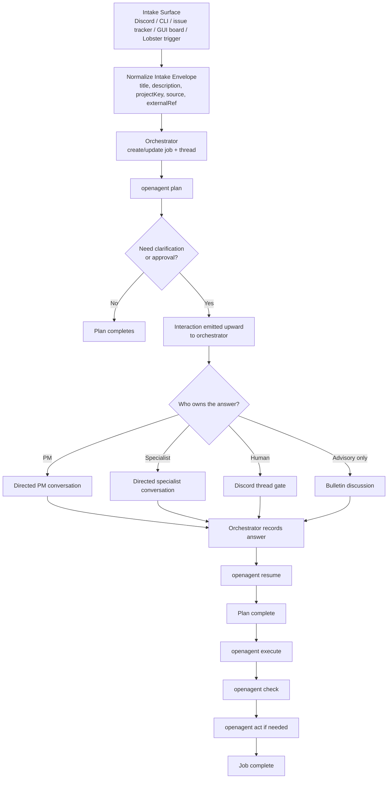
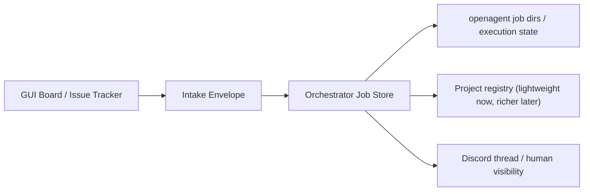

# Orchestra Systems Map

Date: 2026-03-17
Related docs:
- `~/clawd/orchestra/delegated-questing-thompson.md`
- `~/clawd/orchestra/2026-03-16-phase-6-templates-temporal-patterns-design.md`
- `docs/plans/2026-03-16-orchestra-phase-ownership-map.md`
- `docs/plans/2026-03-16-plan-feedback-transport-matrix.md`
- `docs/plans/2026-03-16-plan-feedback-event-schema.md`
- `docs/plans/2026-03-16-plan-feedback-state-machine.md`

## Purpose

Give the system one canonical big-picture map.

This document is meant to answer, quickly:

- what each major piece is
- what it owns
- how they connect
- how work moves from intake to planning to execution
- where project-scoped intake and a future GUI board fit

## One-Sentence Model

The system should behave like this:

- intake surfaces create or update jobs
- the orchestrator owns the job and the conversation topology
- `openagent` runs the PDCA workers for that job
- PM/specialist/human inputs come back through the orchestrator
- bulletin is advisory sidecar discussion, not the default approval path
- Lobster owns long-lived temporal workflows around the system, not the inner worker loop

## The Six Layers

| Layer | What it is | What it owns | What it is not |
|---|---|---|---|
| Intake surface | Discord, CLI, future issue tracker or kanban UI | Creating or updating a work item | The workflow engine |
| Orchestrator | Thread/job conductor | Routing, approvals, actor selection, thread state, job lifecycle | The worker runtime |
| Worker runtime (`openagent`) | PDCA worker sessions | `plan`, `execute`, `check`, `act`, parked SDK sessions, resume, job-dir artifacts | The company operating system |
| Advisory substrate (`bulletin-tools`) | Multi-agent discussion mechanism | Advisory fanout, critique, protocol-based discussion | The single-owner decision path |
| Temporal workflow engine (Lobster) | Long-lived workflows and scheduled patterns | Timers, approvals, resume tokens, multi-step automations | The inner Claude worker loop |
| Runtime substrate (OpenClaw/gateways) | Host environment | sessions, hooks, plugins, cron, Discord connection, agent identities | Business logic for every workflow |

## Canonical Nouns

| Noun | Meaning | Primary owner |
|---|---|---|
| Project | A durable grouping key for work, reporting, and future GUI views | Intake/orchestrator layer |
| Intake item | A request from Discord, CLI, issue tracker, or workflow trigger | Intake surface |
| Job | The canonical unit of work the orchestrator tracks | Orchestrator |
| Thread | The human-visible coordination surface, usually Discord | Orchestrator |
| Worker session | One Claude Agent SDK run for `plan`/`execute`/`check`/`act` | `openagent` |
| Interaction | A worker asking upward for clarification or approval | `openagent` durable control plane, routed by orchestrator |
| Bulletin | Advisory multi-agent discussion artifact | bulletin-tools/mailroom |
| Workflow | A long-lived multi-step business or ops process | Lobster |
| Agent role | PM/dev/security/product/etc. identity and authority text | OpenClaw agent definitions |

## Golden Path



## Ownership By Question

### “Who decides who to ask?”

- the orchestrator

### “Who owns the actual Claude worker session?”

- `openagent`

### “Who owns long waits, schedules, and recurring workflows?”

- Lobster

### “Who owns group discussion?”

- bulletin-tools

### “Who owns product decisions?”

- PM as an agent role, selected and routed by the orchestrator

### “Where does project scope belong?”

- on the job intake/control-plane side, not buried in bulletin state and not invented inside a worker session

## Hard Lines

These are the boundaries that make the whole system understandable.

1. `openagent` is not the orchestra.
2. The orchestrator is the only external counterpart a worker should talk to.
3. Workers emit need; the orchestrator chooses target and transport.
4. Bulletin is advisory only unless the orchestrator explicitly chooses it.
5. PM is a role and decision owner, not a transport primitive.
6. Lobster is the outer workflow engine, not the inner PDCA worker runtime.
7. A GUI board or issue tracker is an intake/view layer over jobs and projects, not a second orchestration engine.

## Where Each Current Piece Fits

### Orchestra

What it is:
- the strategy and operating model

Where it lives:
- `~/clawd/orchestra/`

What it answers:
- what kinds of systems exist
- what phases matter
- what the company-operating model should become

### Orchestrator

What it is:
- the conductor for a thread or job

What it should own:
- job creation
- thread lifecycle
- actor selection
- approval routing
- resume invocation
- project assignment on intake

What it should not own:
- direct worker implementation details
- bulletin internals
- Lobster workflow persistence

### PM

What it is:
- an agent role with product/design approval authority

What it is not:
- a transport
- a bulletin protocol

### Bulletin

What it is:
- asynchronous advisory discussion

Good uses:
- “what do the specialists think?”
- “give me a multi-perspective read”

Bad uses:
- single-owner design approval
- pretending committee consensus is product approval

### Lobster

What it is:
- the outer workflow engine for long-running patterns

Good uses:
- weekly/monthly recurring flows
- approval gates that may take hours or days
- retry, timeout, and resume around business workflows

Bad uses:
- replacing the inner `openagent` PDCA worker loop by default

### `openagent`

What it is:
- the worker runtime

Owns:
- PDCA worker execution
- Claude Agent SDK sessions
- parked/resume
- job-dir worker artifacts
- plan interaction contracts

Does not own:
- company-wide orchestration
- thread governance
- bulletin consensus
- recurring automation logic

## Project-Scoped Intake And Future GUI

The clean mental model is:

- a GUI board is a way to create, view, and filter jobs
- a project is metadata on jobs
- the board should read from the same job/project state the orchestrator already uses

That means a future issue tracker or kanban UI should not invent a parallel workflow model.

It should sit here:



### Recommended intake envelope

Every intake surface should normalize to something like:

```json
{
  "source": "discord|cli|github|linear|plane|lobster",
  "externalRef": "optional source-specific id",
  "projectKey": "optional stable slug",
  "title": "short summary",
  "description": "work request",
  "requestedOutcome": "what done means",
  "priority": "optional",
  "openedBy": "human or workflow id"
}
```

This is the place where “project injection” belongs:

- at intake normalization
- then persisted on the job
- then visible to workers as context
- then queryable in a board

## Current State

### Already true

- `openagent` now treats all PDCA workers as talking upward to the orchestrator when they need clarification.
- plan interactions have a durable control plane and real park/resume.
- PM-directed planning approvals now work as a real path.
- bulletin is no longer the default easy answer for plan approvals.
- the dev box has a clean `openagent` checkout on current `main`.

### Partially true

- the orchestrator has a cleaner route model, but its “hard lines” still need to be made explicit in its docs/behavior.
- project-scoped intake is designed conceptually, but not yet the universal intake envelope for all sources.
- Lobster’s place in the stack is understood, but not yet integrated at the boundary.

### Not true yet

- there is not yet one canonical intake/job/project store visible across Discord and a future board.
- there is not yet one visual dashboard showing job state, project state, thread state, and worker state together.
- Lobster is not yet the outer shell for long-lived approval workflows around orchestrated jobs.

## What To Build Next For Clarity

If the goal is “make the whole system legible,” the next artifacts should be:

1. A canonical intake envelope spec
   - one schema for Discord, CLI, issue tracker, and workflow-triggered jobs
2. An orchestrator hard-lines doc
   - workers emit need
   - orchestrator owns routing
   - bulletin is advisory-only
3. A project/job model doc
   - what a project is
   - what a job is
   - how the board reads them
4. A single timeline view concept
   - intake
   - thread
   - worker runs
   - interactions
   - approvals
   - completion

## If You Only Remember Five Things

1. The orchestrator is the control plane.
2. `openagent` is the worker runtime.
3. Bulletin is discussion, not approval.
4. Lobster is the outer workflow engine.
5. A future board should be a view over jobs and projects, not a second brain.
